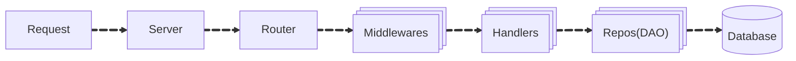

[](https://github.com/rameshsunkara/go-rest-api-example/actions/workflows/cibuild.yml?query=+branch%3Amain)
[](https://goreportcard.com/report/github.com/rameshsunkara/go-rest-api-example)
[](https://app.codecov.io/gh/rameshsunkara/go-rest-api-example)

# REST API microservice in Go

<div style="text-align: center;">
  
</div>

## [Why this?](#why-this)

## Offered Features

### API Features

1. **OWASP Compliant Open API 3 Specification**: Refer to [OpenApi-v1.yaml](./OpenApi-v1.yaml) for details.
2. **Production-Ready Health Checks**:
   - `/healthz` endpoint with proper HTTP status codes (204/424)
   - Database connectivity validation
   - Dependency health monitoring
3. **Comprehensive Middleware Stack**:
   - **Request Logging**: Structured logging with request correlation
   - **Authentication**: Multi-tier auth (external/internal APIs)
   - **Request ID Tracing**: End-to-end request tracking
   - **Panic Recovery**: Graceful error handling and recovery
   - **Security Headers**: OWASP-compliant security header injection
   - **Query Validation**: Input validation and sanitization
   - **Compression**: Automatic response compression (gzip)
4. **Standardized Error Handling**: Consistent error response format across all endpoints
5. **API Versioning**: URL-based versioning with backward compatibility
6. **Internal vs External APIs**: Separate authentication and access controls
7. **Model Separation**: Clear distinction between internal and external data representations

### Go Application Features

1. **Configuration Management**: Environment-based configuration with validation
2. **Graceful Shutdown**: Proper signal handling with resource cleanup and connection draining
3. **Production-Ready MongoDB Integration**:
   - Connection pooling and health checks
   - Functional options pattern for flexible configuration
   - SRV and replica set support
   - Credential management via sidecar files
   - Query logging for debugging
4. **Comprehensive Health Checks**: `/healthz` endpoint with database connectivity validation
5. **Structured Logging**: Zero-allocation JSON logging with request tracing
6. **Secrets Management**: Secure credential loading from sidecar files
7. **Effective Mocking**: Interface-based design enabling comprehensive unit testing
8. **Database Indexing**: Automatic index creation for optimal query performance
9. **Idiomatic Go Architecture**: Clean separation of concerns with dependency injection
10. **Parallel Testing**: Race condition detection with atomic coverage reporting
11. **Context-Aware Operations**: Proper context propagation for cancellation and timeouts
12. **Resource Management**: Automatic cleanup of connections and resources

### Tooling

1. **Dockerized Environment**: Facilitates service deployment using DOCKER_BUILDKIT.
2. **Makefile**: Automates common tasks for developers.
3. **GitHub Actions**: Automates building, testing, code coverage reporting, and enforces the required test coverage threshold.
4. **Multi-Stage Docker Build**: Accelerates build processes.

## Folder Structure

```text
go-rest-api-example/
├── main.go
├── internal/           # Private application code
│   ├── config/         # Configuration management
│   ├── db/             # Database repositories and data access
│   ├── errors/         # Application error definitions
│   ├── handlers/       # HTTP request handlers
│   ├── middleware/     # HTTP middleware components
│   ├── models/         # Domain models and data structures
│   ├── server/         # HTTP server setup and lifecycle
│   ├── util/           # Internal utilities
│   └── mockData/       # Test and development data
├── pkg/                # Public packages (can be imported)
│   ├── logger/         # Structured logging utilities
│   └── mongodb/        # MongoDB connection management
├── localDevelopment/   # Local dev setup (DB init scripts, etc.)
├── Makefile           # Development automation
├── Dockerfile         # Container image definition
├── docker-compose.yaml # Local development services
├── OpenApi-v1.yaml    # API specification
└── OpenApi-v1.postman_collection.json
```

## Control Flow



1. **Request**: Server receives the incoming request.
2. **Server**: Server processes the request and forwards it to the router.
3. **Router**: Router directs the request to the appropriate middleware(s).
4. **Middlewares**: The middlewares handle various tasks such as logging, authentication, security headers, tracing etc.,
5. **Handlers**: The request is passed to the appropriate handler, which validates the request and forwards it to the repository layer.
6. **Repos(DAO)**: The repository layer communicates with the database to perform CRUD operations.

## QuickStart

### Pre-requisites

- Docker
- [Docker Compose](https://docs.docker.com/compose/install/)
- Make
- [golangci-lint](https://golangci-lint.run/welcome/install/#local-installation)
- [docker-buildx](https://docs.docker.com/buildx/working-with-buildx/)

### Frequently used commands

```makefile
start                          Start all necessary services and API server
run                            Run the API server
setup                          Start only dependencies
test                           Run tests with coverage
```

### Development commands

```makefile
lint                           Run the linter
lint-fix                       Run the linter and fix issues
clean                          Clean all Docker resources (keeps database data)
clean-all                      Clean all Docker resources including volumes (removes database data)
clean-volumes                  Remove only the docker-compose volumes (database data)
coverage                       Generate and display the code coverage report
go-work                        Generate Go work file
owasp-report                   Generate OWASP report
tidy                           Tidy Go modules
```

### CI commands

```makefile
build                          Build the API server binary
ci-coverage                    Check if test coverage meets the threshold
format                         Format Go code
version                        Display the current version of the API server
```

### Docker commands

```makefile
docker-build                   Build the Docker image
docker-build-debug             Build the Docker image without cache
docker-clean                   Clean all Docker resources
docker-clean-build-images      Remove build images
docker-compose-up              Start docker-compose services
docker-compose-down            Stop docker-compose services
docker-compose-down-volumes    Stop docker-compose services and remove volumes
docker-remove                  Remove Docker images and containers
docker-run                     Run the Docker container
docker-start                   Build and run the Docker container
docker-stop                    Stop the Docker container
```

## Tools

1. Routing - [Gin](https://github.com/gin-gonic/gin)
2. Logging - [zerolog](https://github.com/rs/zerolog)
3. Database - [MongoDB](https://www.mongodb.com/)
4. Container - [Docker](https://www.docker.com/)

## TODO

- Add comprehensive API documentation with examples
- Implement database migration system
- Add distributed tracing (OpenTelemetry integration)
- Implement circuit breaker pattern for external dependencies
- Add metrics collection and Prometheus integration
- Implement rate limiting middleware
- Add comprehensive integration tests
- Add git hooks for pre-commit and pre-push
- Implement all remaining OWASP security checks
- Add Kubernetes deployment manifests

## Good to have

- **Enhanced Data Models**: Add validation, relationships, and business logic
- **Cloud Deployment**: Kubernetes manifests and Helm charts
- **Advanced Monitoring**: APM integration, alerting, and dashboards
- **Caching Layer**: Redis integration for performance optimization
- **Event Sourcing**: Event-driven architecture with message queues
- **Multi-database Support**: PostgreSQL, CockroachDB adapters
- **Advanced Security**: JWT tokens, OAuth2, RBAC implementation
- **Performance Testing**: Load testing scenarios and benchmarks
- **Documentation**: Auto-generated API docs and architectural decision records

## References

- [gin-boilerplate](https://github.com/Massad/gin-boilerplate)
- [go-rest-api](https://github.com/qiangxue/go-rest-api)
- [go-base](https://github.com/dhax/go-base)

## Contribute

- Please feel free to Open PRs
- Please create issues with any problem you noticed
- Please suggest any improvements

## Why this?

I embarked on the endeavor of crafting my own open-source boilerplate repository for several reasons:

After years of developing Full Stack applications using ReactJS and JVM-based languages, I observed that existing
boilerplates tended to be either excessive or insufficient for my needs.
Consequently, I resolved to construct my own, while adhering rigorously to the principles and guidelines of Go.
While similarities with popular Go boilerplate templates may be evident,
I have customized this repository to better align with my preferences and accumulated experiences.
(My apologies if I inadvertently overlooked crediting any existing templates.)

I yearned for the autonomy to meticulously select the tools for fundamental functionalities such as Routing, Logging,
and Configuration Management, ensuring seamless alignment with my personal preferences and specific requirements.

### What this is not?

- This isn't a complete solution for all your needs. It's more like a basic template to kickstart your project.
- This isn't the best place to begin if you want to make an online store. What I've provided is just a simple tool for managing data through an API.